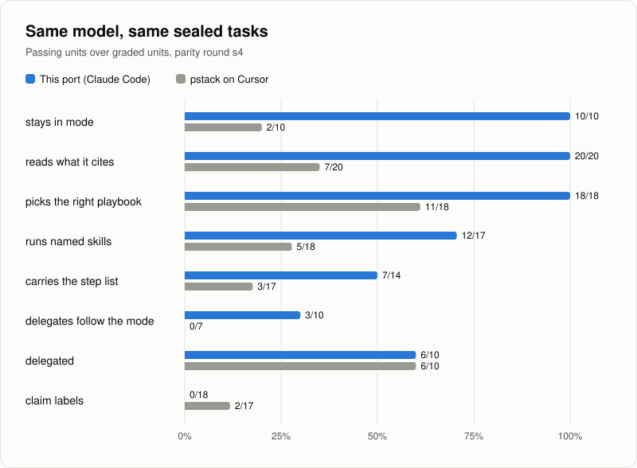
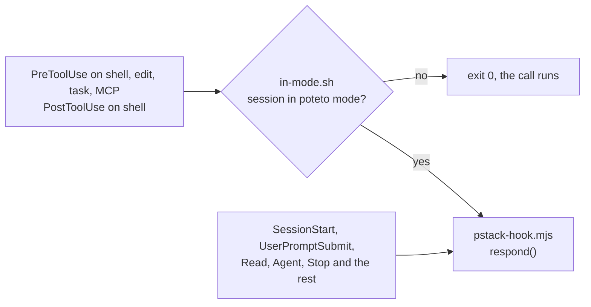
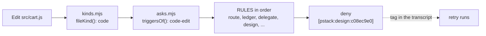
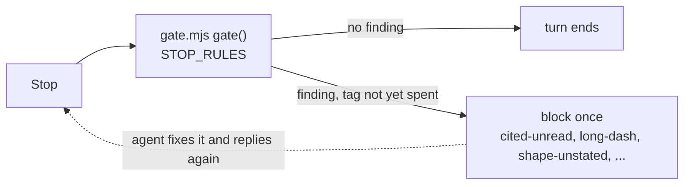

# pstack for Claude Code

[](https://github.com/EvanBatten/pstack-for-cc/actions/workflows/check.yml)
[](LICENSE)
[](https://docs.anthropic.com/en/docs/claude-code)

pstack's skills, playbooks and principles for Claude Code, with a hook that checks each step as the agent works.

pstack is the work of [Lauren Tan (poteto)](https://x.com/poteto), published in [cursor/plugins](https://github.com/cursor/plugins/tree/032be146865d973682535de75f2287da438550bf/pstack) under the MIT license.

## Install

Run this in a macOS or Linux shell, or in Git Bash on Windows, with Claude Code, git and Node.js installed:

```sh
git clone https://github.com/EvanBatten/pstack-for-cc.git ~/pstack-for-cc
node ~/pstack-for-cc/scripts/install.mjs
node ~/pstack-for-cc/skills/verify-pstack/scripts/doctor.mjs
```

Every doctor line starts with `ok`. Start a session and type `/poteto-mode <task>`.

## Same model, same sealed tasks



The harness verdict is INCONCLUSIVE because its control check measured 0.26 and needs 0.30. This port trails on claim labels. [Full report](eval/parity/results/s4/report.md).

## What you get

- **Rules checked at each action.** Before an edit, a shell command, a task list, a spawn or a commit runs, the hook asks for the pstack step it owes.
- **One ask per deny, and no stuck session.** The hook never judges the answer, so once an ask's tag is in the transcript, the retry goes through.
- **Shell writes count as edits.** A `sed -i`, a redirect, `tee`, `cp` or `mv` into a source file meets the same asks as an Edit.
- **Skills and principles tracked from the transcript.** The hook counts what the agent read, so a cited principle it never opened blocks the stop.
- **Every upstream change kept as a diff.** [DRIFT.md](DRIFT.md) lists each file that differs from pstack v0.15.2 and why, and CI fails on a change with no reason.

## What it looks like

The agent edits code before it names the data shape. The hook denies the edit once, and the retry goes through:

```text
● Read(~/.claude/skills/poteto-mode/principles/model-the-domain.md)

● Edit(src/cart.js)
  ⎿ Before editing source, write a line `**Shape.** <the data this change touches and how it is organized>` in your reply, then retry this call unchanged. If you already wrote the Shape line this turn, retry unchanged. [pstack:design:c08ec9e0]
    Do what applies, then retry the call. Where an ask does not apply, say why in a `skip <name>: <reason>` line for the user, then retry.

● **Shape.** A cart is a list of line items, each a product and a quantity.

● Edit(src/cart.js)
  ⎿ Updated src/cart.js
```

## How it works

Every hook event runs one script. A shell filter keeps Node from starting for tool calls outside poteto mode.



Before a call runs, `kinds.mjs` classifies it, and the first row of the `RULES` table that the call owes becomes one deny.



When the turn ends, `gate.mjs` blocks the stop once for each finding it can see for certain.



[docs/runtime.md](docs/runtime.md) lists every hook event, every ask and every stop finding.

<details>
<summary><b>The full comparison and its caveats</b></summary>

The harness is `eval/parity`. It runs five synthetic tasks in sealed sandboxes, twice per task in each of three arms, with every worker on Opus 5.5 at medium effort:

- **A.** Cursor with upstream pstack v0.15.2.
- **C.** Cursor with no pstack.
- **B.** Claude Code with this port. The run used an earlier commit whose installed files differ from this tree only in the `check-port.mjs` maintenance script.

Before it compares this port with upstream, the harness checks that upstream pstack on Cursor scores at least 0.30 above Cursor alone, averaged over the behaviors it scores. In round s4 that margin was 0.26, so the verdict is INCONCLUSIVE.

Two judges grade each reply against a written rubric for each behavior, and a script decides the behaviors that are plain facts. Each cell is the passing units over the graded units. "Split" counts the units the two judges disagreed on, which are left out of the count. A dash means the arm had no unit to grade.

| Behavior | What it measures | B, this port | A, Cursor with pstack | C, Cursor alone |
|---|---|---|---|---|
| Mode stays on | A later turn that the user did not open with `/poteto-mode` still matches a playbook, carries its steps with states, and names the principles it read | 10/10 | 2/10 | 0/10 |
| No long dash | The reply contains no long dash | 20/20 | 20/20 | 20/20 |
| Claim labels | Each sentence that claims runtime behavior, a cause or a prediction that nothing in the session observed carries a measured, inferred or guess label, or its evidence | 0/18, 2 split | 2/17, 3 split | 5/20 |
| Playbook choice | The agent picks the playbook the request calls for without being told its name, and reads that playbook's file | 18/18 | 11/18 | 0/18 |
| Mode off | A casual turn, such as a thank-you, gets a short plain answer with no step list or new work | 2/2 | 2/2 | 2/2 |
| Delegates work in the mode | A delegate that writes code reads each principle before citing it, and its final message carries its steps with states | 3/10 | 0/7 | - |
| Step list | The reply or the task list carries the playbook's steps, each with a state, and each skipped step with a reason | 7/14, 4 split | 3/17, 1 split | 0/18 |
| Named skills run | Each skill a step names is run, or skipped with a reason | 12/17, 1 split | 5/18 | 0/18 |
| Cited principles read | Every principle the reply names was read in full earlier in the session | 20/20 | 7/20 | 0/20 |
| Read-only delegates | On a read-only task, no delegate writes a file | - | 1/1 | - |
| Delegated | On a task that calls for a delegate, the run spawns at least one | 6/10 | 6/10 | 0/10 |

The harness marks this port short of upstream pstack by more than 0.10 on claim labels. It has too few graded units to compare the two on mode off and read-only delegates.

- The samples are small. Most cells hold 10 to 20 graded units, and the mode-off and read-only-delegate cells hold 1 or 2.
- 19 of the 20 Cursor runs were recorded in an earlier round and graded again in this one.
- Both judges are Claude Opus. A third judge on a non-Claude model was left out after it failed calibration and then reached its usage limit before it could be calibrated again.
- On seeded faults, both judges detected 1.00 of the faults, with false-flag rates of 0.02 and 0.07 on untouched units.
- This stage did not score model per role, panel width, a standing objective, file-pattern attach, a pause before an irreversible action, or cloud workers, routines and webhooks.

The raw counts and intervals are in [`report.json`](eval/parity/results/s4/report.json). `node scripts/chart.mjs` draws the chart from it.

To run the comparison again, you need Windows with `cursor-agent` installed by its Windows installer, Claude Code, and Cursor usage for the Cursor arms. Run the tick until `--status` shows every run and judgment done:

```sh
node eval/parity/parity.mjs --init --stamp s4 --arms A,C,B --tree B=HEAD
node eval/parity/parity.mjs --tick --stamp s4
node eval/parity/parity.mjs --status --stamp s4
node eval/parity/parity.mjs --report --stamp s4
```

`--report` writes `report.md` and `report.json` under `pstack-parity/s4` in the temp directory.

</details>

<details>
<summary><b>What the installer does, and installing by hand</b></summary>

`scripts/install.mjs` reads [`install.json`](install.json). `skills` and `agents` list the repo paths to link and the directories to link them into. `hooks` and `env` have the same shape as the keys of the same name in `~/.claude/settings.json`.

- It links each path on its own, named after its last segment, so skills and agents from other places stay beside them. It tries a symbolic link first. On Windows without the right to make one, it makes a directory junction for a skill and copies an item it cannot link. `--copy` copies every item.
- It replaces a link that points somewhere else. It leaves a real file or directory it did not make, reports the conflict and exits 1.
- It merges `hooks` and `env` into `~/.claude/settings.json`. It removes only the hook entries that run `pstack-hook.mjs` or the older `session-context.mjs`, appends the groups from `install.json` and sets each `env` variable. Before it writes, it copies the old file to `settings.json.bak-<time>`.
- `--dry-run` prints each change prefixed with `would ` and writes nothing.
- `--opt-in agents` also links the skills into `~/.agents/skills`, which Codex and other agents read.

Run `/setup-pstack` once to choose the models each role uses. To update, run `git pull` in the clone. The links point into it, so a changed skill is live on its next read. Run the installer again when `install.json` changes. A second run changes nothing that is already in place.

To install by hand on macOS, Linux or Git Bash:

```sh
repo=~/pstack-for-cc
paths() { (cd "$repo" && node -p "require('./install.json').$1.paths.join(' ')"); }
mkdir -p ~/.claude/skills ~/.claude/agents
for p in $(paths skills); do ln -s "$repo/$p" ~/.claude/skills/; done
for p in $(paths agents); do ln -s "$repo/$p" ~/.claude/agents/; done
```

In PowerShell, which needs Developer Mode or an administrator shell to make a symbolic link:

```powershell
$repo = "$HOME/pstack-for-cc"
$manifest = Get-Content -Raw "$repo/install.json" | ConvertFrom-Json
foreach ($group in $manifest.skills, $manifest.agents) {
	foreach ($into in $group.into) {
		foreach ($path in $group.paths) {
			$link = Join-Path ($into -replace '^~', $HOME) (Split-Path $path -Leaf)
			New-Item -ItemType SymbolicLink -Path $link -Target (Join-Path $repo $path)
		}
	}
}
```

Then open `~/.claude/settings.json`, remove any hook entry that runs `pstack-hook.mjs`, and copy each event under `hooks` and each variable under `env` from `install.json` into it.

</details>

<details>
<summary><b>Layout</b></summary>

[`install.json`](install.json) decides what a machine installs, so a file can sit in the repo without reaching `~/.claude`.

| Path | What it holds | Installed |
|---|---|---|
| `skills/` | 29 skills: 24 from pstack, 4 from `cursor-team-kit`, and `verify-pstack`, which this port adds | Each skill `install.json` names |
| `skills/poteto-mode/playbooks/` | The 23 playbooks that `/poteto-mode` matches a task to | With `poteto-mode` |
| `skills/poteto-mode/principles/` | pstack's 23 principles, one file each | With `poteto-mode` |
| `skills/poteto-mode/hooks/` | The hook: `pstack-hook.mjs` answers the events, `trace.mjs` parses transcripts, `asks.mjs` and `gate.mjs` hold the rules, `kinds.mjs` classifies files and commands, and `catalog.mjs` reads the skills | Registered from `install.json` |
| `agents/` | `poteto-agent`, `comment-sicko`, and `pstack-reader`, the read-only delegate that `how`, `why` and `interrogate` spawn | Each agent `install.json` names |
| `automations/benny/` | Benny, two issue-report automations from upstream, with [`PORT.md`](automations/benny/PORT.md) mapping it to Claude Code | No |
| `docs/guide/` | Lauren Tan's guide to pstack | No |
| `docs/research/` | Notes on pstack's method, skills and playbooks | No |
| `docs/port-audit/` | The earlier reference port's `PORT.md` and `PATCHES.md`, and the `check-port.mjs` census runs from the port sweep | No |
| `eval/parity/` | The eval behind the chart, and its round s4 results | No |
| `scripts/` | The installer, the drift map, the chart, the transcript audit and replay, and their tests | No |

</details>

<details>
<summary><b>Checking a change</b></summary>

Run these from the repo root:

```sh
node --test $(git ls-files '*.test.js')
node skills/poteto-mode/scripts/check-port.mjs skills agents
node scripts/drift.mjs --check
```

The first runs every test, the second prints `0 findings`, and the third prints `DRIFT.md is current`.

- `check-port.mjs` fails on text that still assumes a feature of the plugin's original host, such as a todolist, `/goal`, `readonly` or `/tmp`, and on a shipped model default outside the known tiers. An owner can list their own project names, one regex per line, in `.port-check-terms` at the repo root, and the check then flags any file that names one. The file is ignored by git.
- `drift.mjs --check` compares each file against the three history tags. It fails when a changed file has no drift class in `scripts/drift.mjs` or when `DRIFT.md` is stale. It needs those tags in the clone.
- `.github/workflows/check.yml` runs all three on every pull request, with the Bun tests for the `orch` and `watch-pr` scripts.

To prove the hook in real sessions, run `bash skills/verify-pstack/scripts/drive.sh` after installing. It starts three headless sessions and prints eight verdicts: hook-context, mode-reminder, step-ledger, gate, action-gate, reader, task-tools and port-clean. It exits 0 only when all eight read VERIFIED. [skills/verify-pstack/SKILL.md](skills/verify-pstack/SKILL.md) says what each verdict checks.

`node scripts/audit-transcripts.mjs --skills ~/.claude/skills <session.jsonl>` reports how a recorded session used pstack. `node scripts/replay-demands.mjs <session.jsonl>` prints each ask the hook would raise over a recorded session.

</details>

<details>
<summary><b>History tags</b></summary>

The history starts with three tagged layers, and every later change sits on top of them.

| Tag | Content |
|---|---|
| `upstream-v0.15.2` | pstack v0.15.2 and the `cursor-team-kit` skills `control-cli`, `control-ui`, `deslop` and `verify-this`, byte for byte from cursor/plugins@032be14 |
| `port-reference` | The first mechanical Claude Code port |
| `live-2026-09-23` | The installed copies the port grew from |

[DRIFT.md](DRIFT.md) lists every file that changed from upstream, by layer, with the reason for each change. To record a new change, add a class to the last layer in `scripts/drift.mjs`, commit, run `node scripts/drift.mjs`, and commit `DRIFT.md`.

</details>

<details>
<summary><b>Updating from upstream</b></summary>

Diff `pstack/` in cursor/plugins from `032be14` to the new commit and apply the changes you want under the same paths. Then run `node skills/poteto-mode/scripts/port-codemod.mjs` for the mechanical rewrites, fix what `check-port.mjs` still reports, and record the drift.

</details>

<details>
<summary><b>Credits and license</b></summary>

pstack's skills, playbooks, principles, guide and Benny automation are Lauren Tan's work, MIT licensed. Her README is in [docs/UPSTREAM-README.md](docs/UPSTREAM-README.md) and her guide is in [docs/guide/](docs/guide/README.md). The `cursor-team-kit` skills are Cursor's, MIT licensed. Their notices are in [LICENSE](LICENSE) and [LICENSES/cursor-team-kit.txt](LICENSES/cursor-team-kit.txt).

</details>
